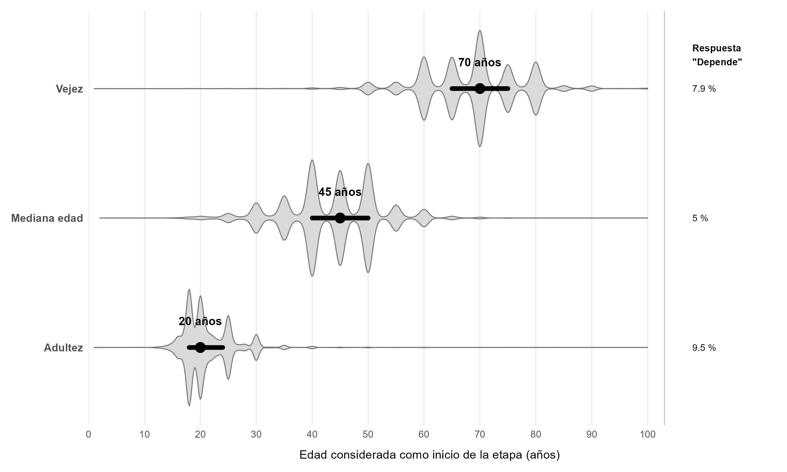
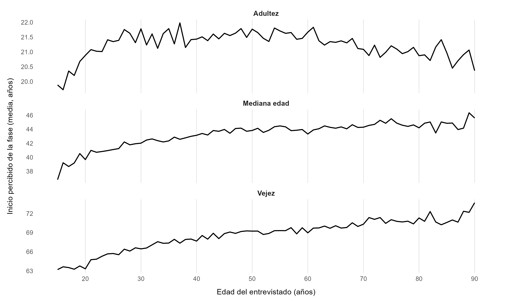

```{r carga_datos, include=FALSE}

library(dplyr)
library(tidyr)
library(here)

ruta_datos <- here::here(
  "03_Datos",
  "datos_procesados",
  "datos_limpios.rds"
)

stopifnot(file.exists(ruta_datos))

datos_limpios <- readRDS(ruta_datos)
```

```{r auxiliar, include=FALSE}
fases <- c(
  ageadlt = "Adultez",
  agemage = "Mediana edad",
  ageoage = "Vejez"
)

# Funciones auxiliares

fmt_num <- function(x, digits = 2){
  formatC(x, format = "f", digits = digits, decimal.mark = ",")
}

fmt_rho <- function(x) {
  fmt_num(x, 2)
}  

interpretar_rho <- function(r) {
  a <- abs(r)
  if (a < .10) "prácticamente nula"
  else if (a < .30) "asociación débil"
  else if (a < .50) "asociación moderada"
  else "asociación fuerte"
}

fase_sin_depende <- function(x) {
  x[x == 0] <- NA
  x
}
```

## Acerca de 

¿Cuándo consideramos que empieza cada etapa de la vida: percepciones compartidas, 
diversas y su relación con la forma en que proyectamos el futuro y valoramos 
nuestra vida?

El proyecto analiza 10 variables de la **European Social Survey, Round 9 (ESS9)**,
recogida en 2018/2019, pertenecientes al módulo rotatorio 
*Timing of Life* sobre percepciones y normas sociales relacionadas 
con el curso vital 

- **49.519** entrevistados 
- **29** países
- Población de **15 años o más**
- **Entrevistas presenciales** 

El **análisis efectuado es de carácter exploratorio y no causal** 

## Objetivo principal 

Analizar cómo se precibe el inicio de la adultez, la mediana edad y la vejez 
en la población europea estudiada en ESS9, examinando el grado de consenso, las
diferencias según edad, sexo y país y su relación con la planificación del futuro
y el bienestar subjetivo

## Objetivo específico 1

**Caracterizar las edades percibidas de inicio de la adultez, mediana edad y 
vejez y el grado de consenso existente sobre ellas** 

Para caracterizar estas percepciones se analiza la distribución de las edades 
atribuidas al inicio de cada etapa, utilizando la mediana como referencia y el 
intervalo intercuartílico para valorar su grado de concentración. 

La respuesta "Depende" se conserva como categoría válida. En el caso de la adultez,
la interpretación tiene además en cuenta el diseño *plit ballot* de ESS9. 

Las etapas presentan una ordenación clara, aunque existe variabilidad en las 
edades atribuidas a su inicio. Las medianas reflejan referencias compartidas, 
no fronteras rígidas. 

## Edades percibibidas por etapa vital 

```{r, echo=FALSE, out.width='100%', fig.align='center'}


```

## Objetivo específico 2 

**Examinar las diferencias en estas percepciones según el sexo, el país y
la edad de los entrevistados**

Para estas comparaciones se utilizan únicamente las respuestas numéricas; la 
categoría "Depende" queda fuera del análisis. 

```{r calculo_sexo, include=FALSE}
p_gndr <- sapply(names(fases), function(v){
  d <- datos_limpios %>%
    transmute(
      gndr = gndr,
      fase = fase_sin_depende(.data[[v]])
    ) %>%
    filter(!is.na(gndr), !is.na(fase))
  
  wilcox.test(fase~gndr, data = d, exact = FALSE)$p.value
})
```

Las diferencias según sexo son estadísticamente significativas en las tres 
etapas (`r if(all(p_gndr < .001)) "*p* < 0,001" else "no todas alcanzan *p* < 0,001"`) 
, aunque su pequeña magnitud aconseja interpretarlas con cautela.

```{r calculo_pais, include=FALSE}
info_pais <- datos_limpios %>%
  
  select(cntry, ageadlt, agemage, ageoage) %>%
  
  pivot_longer(
    cols = c(ageadlt, agemage, ageoage),
    names_to = "variable",
    values_to = "edad_percibida"
  ) %>%
  
  mutate(
    fase = recode(
      variable,
      ageadlt = "Adultez",
      agemage = "Mediana edad",
      ageoage = "Vejez"
    ),
    
    fase = factor(
      fase,
      levels = c("Adultez", "Mediana edad", "Vejez")
    )
  ) %>%
  
  filter(
    !is.na(cntry),
    !is.na(edad_percibida),
    edad_percibida != 0
  )

info_resumen_pais <- info_pais %>%
    group_by(fase, cntry) %>%
  summarise(
    mediana = median(edad_percibida, na.rm = TRUE),
    n = n(),
    .groups = "drop"
  )

# Rango de las medianas nacionales por fase 

info_rango_pais <- info_resumen_pais %>%
    summarise(
      adultez_min = min(mediana[fase == "Adultez"], na.rm = TRUE),
      adultez_max = max(mediana[fase == "Adultez"], na.rm = TRUE),
      mediana_edad_min = min(mediana[fase == "Mediana edad"], na.rm = TRUE),
      mediana_edad_max = max(mediana[fase == "Mediana edad"], na.rm = TRUE),
      vejez_min = min(mediana[fase == "Vejez"], na.rm = TRUE),
      vejez_max = max(mediana[fase == "Vejez"], na.rm = TRUE)
  ) 
```

Las medianas nacionales varían entre `r info_rango_pais$adultez_min` y `r info_rango_pais$adultez_max` años para el inicio de la adultez, entre `r info_rango_pais$mediana_edad_min` y `r info_rango_pais$mediana_edad_max` años para la mediana edad, y entre `r info_rango_pais$vejez_min` y `r info_rango_pais$vejez_max` años para la vejez. Estas diferencias muestran que los puntos de referencia sobre el inicio de las etapas vitales no son completamente homogéneos entre países. 

## Edad de los entrevistados 

Para explorar si estas percepciones varían con la propia edad, se compara la 
edad percibida media de inicio de cada etapa vital para cada edad del entrevistado.

La propia edad se relaciona con estas percepciones, especialmente en la mediana 
edad y la vejez, cuyo inicio se sitúa progresivamente más tarde. En adultez, 
el patrón es menos lineal y debe interpretarse con mayor cautela por el diseño
*split ballot*.

##  Percepciones según la propia edad

```{r, echo=FALSE, out.width='100%', fig.align='center'}

```


## Objetivo específico 3

**Explorar la relación entre las percepciones de las etapas vitales y la 
planificación del futuro, la felicidad y la satisfacción con la vida**

```{r calculo_relaciones, include=FALSE}

relaciones_fases <- datos_limpios %>%
  summarise(
    felicidad_adultez = cor(ageadlt[ageadlt != 0], happy[ageadlt != 0], method = "spearman",
                        use = "complete.obs"),
    felicidad_mediana_edad = cor(agemage[agemage != 0], happy[agemage != 0], method = "spearman",
                        use = "complete.obs"),
    felicidad_vejez = cor(ageoage[ageoage != 0], happy[ageoage != 0], method = "spearman",
                        use = "complete.obs"),
    
    satisfaccion_adultez = cor(ageadlt[ageadlt != 0], stflife[ageadlt != 0], method = "spearman",
                        use = "complete.obs"),
    satisfaccion_mediana_edad = cor(agemage[agemage != 0], stflife[agemage != 0], method = "spearman",
                        use = "complete.obs"),
    satisfaccion_vejez = cor(ageoage[ageoage != 0], stflife[ageoage != 0], method = "spearman",
                        use = "complete.obs"),
    
    planificacion_adultez = cor(ageadlt[ageadlt != 0], plnftr[ageadlt != 0], method = "spearman",
                        use = "complete.obs"),
    planificacion_mediana_edad = cor(agemage[agemage != 0], plnftr[agemage != 0], method = "spearman",
                        use = "complete.obs"),
    planificacion_vejez = cor(ageoage[ageoage != 0], plnftr[ageoage != 0], method = "spearman",
                        use = "complete.obs"),
  )
```

Las asociaciones se examinan mediante correlaciones de Spearman entre las edades
percibidas de incio de cada fase y las tres variables. 

Para **felicidad**, las correlaciones son ρ = `r fmt_rho(relaciones_fases$felicidad_adultez)` en la adultez, ρ = `r fmt_rho(relaciones_fases$felicidad_mediana_edad)` en la mediana edad y ρ = `r fmt_rho(relaciones_fases$felicidad_vejez)` en la vejez.

Para **satisfacción con la vida**, se observa un patrón similar: ρ = `r fmt_rho(relaciones_fases$satisfaccion_adultez)`, ρ = `r fmt_rho(relaciones_fases$satisfaccion_mediana_edad)` y ρ = `r fmt_rho(relaciones_fases$satisfaccion_vejez)`, respectivamente. 

La relación con la **la planificación del futuro** también es muy débil: ρ = `r fmt_rho(relaciones_fases$planificacion_adultez)`, ρ = `r fmt_rho(relaciones_fases$planificacion_mediana_edad)` y ρ = `r fmt_rho(relaciones_fases$planificacion_vejez)`.

En conjunto, las asociaciones son de magnitud muy reducida: ligeramente inversas 
para la adultez y positivas o prácticamente nulas para la mediana edad y la vejez. 

## Síntesis y perspectivas 

- Las percepciones de las etapas vitales **están relacionadas, aunque solo parcialmente** 
y varían con la propia edad y entre países; las diferencias por sexo son de 
pequeña magnitud.

- La **medinana edad** ocupa una posición especialmente 
relevante: es la fase más relacionada con la vejez y su inicio percibido se 
desplaza progresivamente con la edad de los entrevistados.

- Las percepciones sobre las etapas de la vida apenas 
se relacionan con bienestar subjetivo y la orientación al futuro, apuntando a 
**dimensiones diferenciadas**. 

- Los **tamaños muestrales** son **desiguales entre países** y el 
diseño *split ballot* afecta especialmente al análisis de la adultez. 
Los **resultados** son **descriptivos** y no causales. 

- Como siguiente paso, explorar conjuntamente los factores 
individuales y territoriales mediante **análisis multivariante**. 

## Fuentes 

1. Billiari FC, Badolato L, Hagestad GO, Liefbroer AC, Settersten RA Jr, Spéder Z, et al. *The Timing of Life: Topline results from Round 9 of the European Social Survey*. ESS Topline Results Series. Issue 11. European Social Survey ERIC; 2021.
[Documento](https://www.europeansocialsurvey.org/sites/default/files/2023-06/TL11_Timing_of_Life-English.pdf)

2. European Social Survey ERIC. *ESS Round 9: European Social Survey Round 9 Data*. Edition 3.3.
Bergen Sikt – Norwegian Agency for Shared Services in Education and Research; 2024.
[Datos](https://doi.org/10.21338/ess9e03_3)
