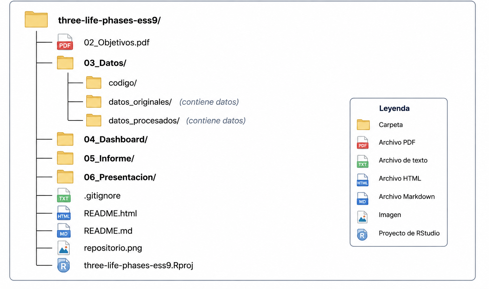

# Percepciones de las etapas de la vida en los países europeos de ESS9

Proyecto desarrollado en **R** a partir de datos de la **European Social Survey, Round 9 (ESS9)**, centrado en el módulo rotatorio *Timing of Life*. El objetivo es analizar cómo se percibe el inicio de la adultez, la mediana edad y la vejez en la población europea estudiada, así como las diferencias entre grupos y países y su relación con factores psicosociales.  

## Pregunta de investigación

**¿Cuándo consideramos que empieza cada etapa de la vida: percepciones compartidas, diversas y su relación con la forma en que proyectamos el futuro y valoramos nuestra vida?**

## Objetivos 

### Objetivo principal 

Analizar cómo se percibe el inicio de la adultez, la mediana edad y la vejez en la población europea estudiada en el ESS9, examinando el grado de consenso, las diferencias según edad, sexo y país y su relación con la planificación del futuro y el bienestar subjetivo.

### Objetivos específicos 

1. Caracterizar las edades percibidas de inicio de la adultez, la mediana edad y la vejez y el grado de consenso existente sobre ellas.
2. Examinar las diferencias en estas percepciones según la edad y el sexo de los entrevistados y entre países. 
3. Explorar la relación entre las percepciones de las etapas vitales y la planificación del futuro, la felicidad y la satisfacción con la vida.

## Datos 

El proyecto utiliza datos de la **European Social Survey, Round 9 (ESS9)**, recogidos en **2018/2019**. La ESS es una encuesta social comparada de carácter transversal y multinacional. 

El análisis parte del fichero integrado de ESS9:

- **Observaciones:** 49.519 personas.
- **Variables del fichero original:** 575.
- **Cobertura:** 29 países.
- **Módulo principal:** *Timing of Life*.
- **Población objetivo:** personas de 15 años o más residentes en hogares privados.
- **Recogida de datos:** entrevistas presenciales.

El módulo *Timing of Life* estudia las percepciones y normas sociales relacionadas con el curso vital. Al tratarse de un módulo rotatorio, su periodicidad no coincide necesariamente con la periodicidad general de las rondas de la ESS. 

**Nota sobre la vigencia de los datos:** ESS9 (2018/2019) es anterior a la pandemia de COVID-19. Este contexto debe tenerse en cuenta al interpretar los resultados, que reflejan las percepciones existentes en el momento de la recogida de los datos. 

## Variables analizadas

El conjunto de datos de trabajo contiene diez variables analizadas:

| Variable | Descripción |
|---|---|
| `ageadlt`| Edad aproximada a la que se considera que las mujeres o los hombres se convierten en adultos. |
| `agemage`| Edad aproximada a la que se considera que las mujeres o los hombres alcanzan la mediana edad. |
| `ageoage`| Edad aproximada a la que se considera que las mujeres o los hombres alcanzan la vejez. |
| `admge`| Variable de administración del *Split ballot*. |
| `gndr`| Sexo de la persona entrevistada. |
| `agea`| Edad calculada de la persona entrevistada. |
| `cntry`| País. |
| `plnftr`| Planificación del futuro frente a vivir el día a día. |
| `happy`| Grado de felicidad considerando todas las cosas en conjunto. |
| `stflife`| Satisfacción con la vida en conjunto. |

En `ageadlt`, `agemage` y `ageoage`, el código **0 = "Depende"** constituye una respuesta válida y se conserva como tal. Los códigos especiales que representan valores perdidos se convierten en `NA`. No se realiza imputación de valores perdidos. 

La variable `admge` permite controlar el diseño *split ballot* utilizado en las preguntas sobre las fases vitales. Este aspecto resulta especialmente relevante para la interpretación de `ageadlt`. 

## Estrategia de análisis 

El análisis se organiza en tres bloques que responden a los objetivos específicos. 

Se emplean principalmente **medianas e intervalos intercuartílicos (IQR)** para describir las edades percibidas. En las comparaciones entre países se tiene en cuenta que los **tamaños muestrales son desiguales**, por lo que el tamaño de la muestra se proporciona como información complementaria para la interpretación de los resultados. Las asociaciones y las diferencias exploradas se interpretan tanto atendiendo a su significación estadística como a su magnitud. 

El análisis es **exploratorio y no causal**.

## Flujo de trabajo reproducible 

El proyecto está organizado para que el proceso pueda reproducirse desde los datos originales hasta los productos finales. El repositorio incluye el conjunto original utilizado (**ESS Round 9, Edition 3.3**), junto con su documentación asociada y el conjunto de datos procesado. Los scripts permiten reproducir el flujo de importación y depuración aplicado en el proyecto. Para la consulta, descarga y reutilización de los datos, se recomienda acudir al **ESS Data Portal** y consultar las condiciones de uso establecidas por la **European Social Survey (ESS)**. 

El flujo general comprende: 

1. Importación del fichero original de ESS9.
2. Selección de las variables utilizadas en el proyecto.
3. Depuración y tratamiento explícito de los valores perdidos.
4. Generación de las visualizaciones y del dashboard interactivo.
5. Elaboración de un informe técnico. 
6. Elaboración de una presentación con los principales resultados. 

Los scripts y documentos R Markdown contienen el código necesario para reproducir las distintas etapas del análisis. 

## Estructura del repositorio 

 

**Nota:** La carpeta `datos_originales/` contiene el fichero original de **ESS Round 9, Edition 3.3** utilizado en el proyecto y su documentación asociada. La carpeta `datos_procesados/` contiene el conjunto de datos depurado generado mediante los scripts de importación y depuración incluidos en `03_Datos/codigo/`.                  

El dashboard se proporciona como archivo HTML autónomo, que puede abrirse directamente en un navegador y conserva las principales funcionalidades. Se incluye también código fuente de esta versión (`dashboard.Rmd`) y una versión alternativa con Shiny (`dashboard_shiny.Rmd`) para su ejecución desde R/RStudio. Los documentos finales del proyecto pueden reproducirse mediante los scripts de compilación incluidos.

## Fuentes y documentación 

- Billari FC, Badolato L, Hagestad GO, Liefbroer AC, Settersten RA Jr, Spéder Z, et al. The Timing of Life: Topline results from Round 9 of the European Social Survey. ESS Topline Results Series. Issue 11. European Social Survey ERIC; 2021. 
[The Timing of Life - Topline Results (TL11)](https://www.europeansocialsurvey.org/sites/default/files/2023-06/TL11_Timing_of_Life-English.pdf)
- European Social Survey ERIC. ESS Round 9: European Social Survey Round 9 Data. Edition 3.3. Bergen Sikt – Norwegian Agency for Shared Services in Education and Research; 2024. Incluye los datos del ESS9 y su documentación asociada. 
[ESS Round 9 - Edition 3.3](https://doi.org/10.21338/ess9e03_3)
- **European Social Survey - Data Portal**
[European Social Survey](https://www.europeansocialsurvey.org/data-portal)
- **European Social Survey - Condiciones de uso**
[European Social Survey](https://www.europeansocialsurvey.org/contact/disclaimer)

## English summary 

### Perceptions of life stages in ESS9 European countries 

This repository contains a reproducible data analysis project developed in **R** using data from the *Timing of Life* module of the **European Social Survey Round 9 (ESS 9)**. The project examines perceived ages for the onset of adulthood, middle age, and old age, their variation across sociodemographic groups and countries, and their relationship with psychosocial factors.

The repository includes the complete reproducible workflow, from data import and cleaning to exploratory analysis, an interactive dashboard, a technical report, and a presentation of the main findings.

The project documentation and analytical outputs are primarily written in **Spanish**. 